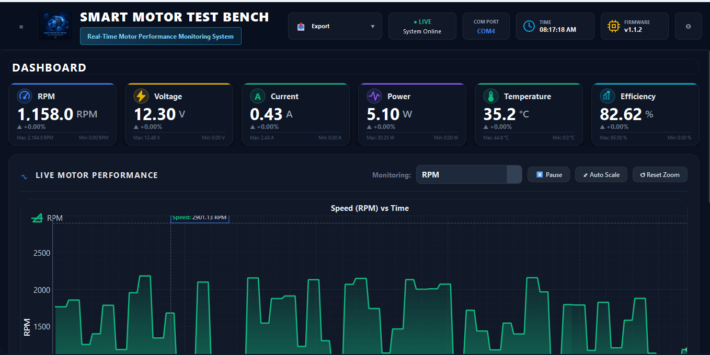
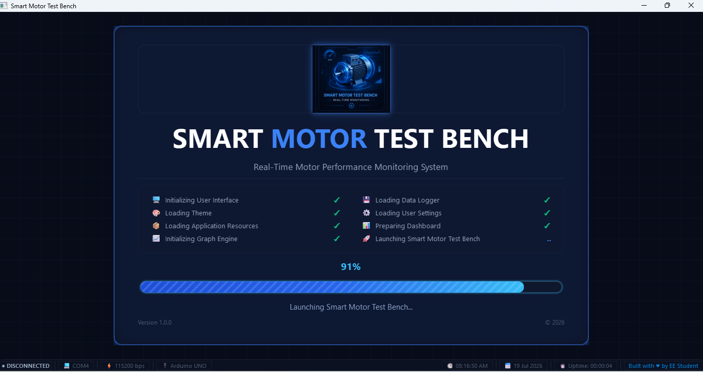
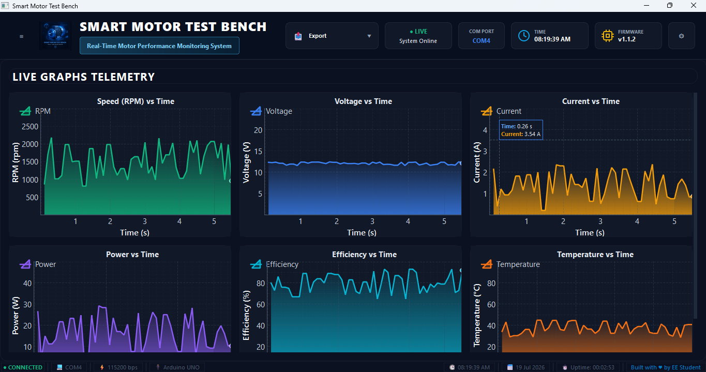
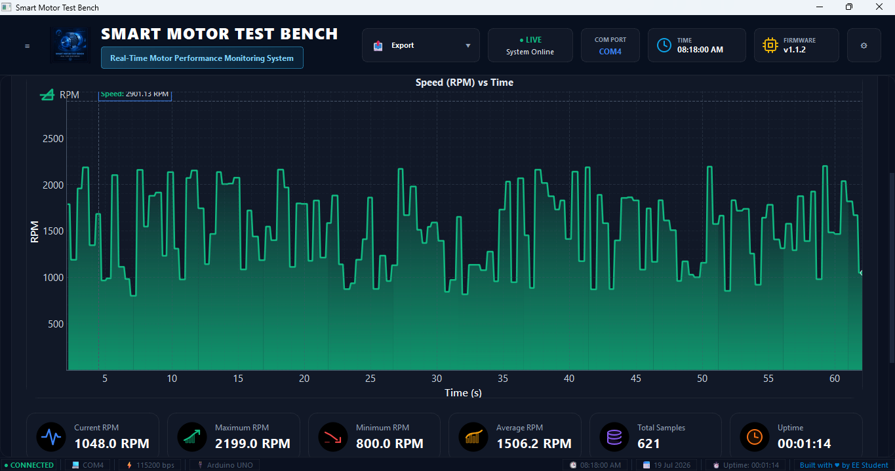
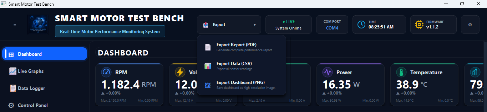

# 🚀 Smart Motor Test Bench

> **A Real-Time DC Motor Performance Monitoring System built using Arduino UNO, Python and PyQt5.**

---

# 🖥 Dashboard Preview

> *(Insert your best dashboard screenshot here)*

---

# 📖 About the Project

Smart Motor Test Bench is a desktop application developed to monitor and analyze the real-time performance of a DC motor.

The software communicates with Arduino using Serial Communication and provides live visualization of motor parameters including RPM, Voltage, Current, Power, Temperature and Efficiency through a modern industrial dashboard.

It also provides professional reporting and export capabilities.

---

# ✨ Features

---

## 🚀 Startup Screen

> *(Insert Startup Screen Screenshot)*

### Features

- Modern splash screen
- Animated loading
- System initialization
- Device detection
- Professional branding

---

## 🖥 Main Dashboard

> *(Insert Dashboard Screenshot)*

### Dashboard includes

- Live RPM
- Voltage
- Current
- Power
- Temperature
- Efficiency

Each parameter displays:

- Current Value
- Maximum Value
- Minimum Value
- Percentage Change

---

## 📈 Live Graphs

> *(Insert Graph Screenshot)*

### Features

- Real-time plotting
- Auto scaling
- Zoom controls
- Pause graph
- Reset graph
- Multiple parameter selection

---

## 📊 Statistics Panel

> *(Insert Statistics Screenshot)*

Displays:

- Current Value
- Maximum Value
- Minimum Value
- Average Value
- System Uptime

---

## 📤 Export System

> *(Insert Export Screenshot)*

Supports:

- Export Report (PDF)
- Export Data (CSV)
- Export Dashboard (PNG)
- Capture Screenshot

---

## ⚙ Top Control Bar

> *(Insert Top Bar Screenshot)*

Displays

- Export Menu
- Connection Status
- COM Port
- Current Time
- Firmware Version
- Settings

---

# 📡 Parameters Monitored

- RPM
- Voltage
- Current
- Power
- Temperature
- Efficiency

---

# 🔧 Technologies Used

### Programming

- Python 3
- Arduino C++

### GUI

- PyQt5

### Communication

- PySerial

### Data Processing

- NumPy
- Pandas

### Graphs

- Matplotlib

### Reports

- ReportLab
- FPDF2

---

# 🧰 Hardware Components

- Arduino UNO
- ACS712 Current Sensor
- Voltage Sensor
- Hall Effect Sensor
- Temperature Sensor
- 16x2 LCD
- L298N Motor Driver
- DC Motor

---

---

# 🚀 Future Improvements

- ESP32 Support
- Cloud Monitoring
- Wi-Fi Connectivity
- AI Predictive Maintenance
- Mobile Dashboard
- MQTT Support

---

# 📜 License

MIT License

---

# 👨‍💻 Developer

**Muhammad Rusab Chaudhary**

Electrical Engineering Student

University of Engineering and Technology (UET) Lahore

---

# ⭐ Support

If you found this project useful,

⭐ Star the repository.